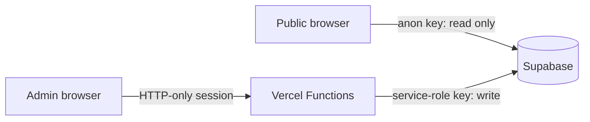

# What's Jake Doing?

[](https://github.com/Jqkeyyy/whatsjakedoing/actions/workflows/ci.yml)

A small, cosmic-themed availability and calendar site. Visitors can see whether Jake is free or busy, browse upcoming events, and subscribe to an ICS calendar feed. A password-protected admin area manages events, categories, and temporary status overrides.

## Features

- Live free/busy status derived from the current event or a temporary override
- Day, week, and month calendar views
- Daily and weekly recurring events
- Public ICS feed at `/api/calendar.ics`
- Responsive, reduced-motion-aware interface
- Password-protected admin tools at `/admin`
- Supabase Row Level Security for public reads and server-only writes
- Automated tests, builds, and dependency updates

## Built with

- React, TypeScript, Vite, and Tailwind CSS
- Supabase Postgres
- Vercel Functions
- Vitest and Testing Library

## Security model

The browser uses a Supabase anonymous key and can only read rows allowed by the database's Row Level Security policies. Admin mutations go through Vercel Functions, which verify an HTTP-only session cookie before using the server-only Supabase service-role key.



> [!IMPORTANT]
> This is a public calendar. Event titles, categories, times, locations, active status overrides, and the ICS feed must be treated as public information. Do not enter private appointments, home addresses, travel details, or anything else you would not publish openly.

The `NEXT_PUBLIC_SUPABASE_URL` and `NEXT_PUBLIC_SUPABASE_ANON_KEY` values are intentionally visible in the browser. Their safety depends on keeping Row Level Security enabled. `SUPABASE_SERVICE_ROLE_KEY`, `ADMIN_PASSWORD_HASH`, and `SESSION_SECRET` are server-only secrets and must never be committed or given a public prefix.

See [SECURITY.md](SECURITY.md) for vulnerability reporting and the production checklist.

## Local setup

### Prerequisites

- Node.js 20 or newer
- npm
- A Supabase project
- Vercel CLI if you want to run the admin API locally

### 1. Install dependencies

```bash
npm ci
```

### 2. Create the database

Run [`supabase/migrations/20260728210000_create_calendar_schema.sql`](supabase/migrations/20260728210000_create_calendar_schema.sql) in the Supabase SQL editor or apply it with the Supabase CLI. The migration creates the tables, indexes, Row Level Security policies, and read-only public access.

### 3. Configure the environment

Copy `.env.example` to `.env.local`, then fill in your Supabase values:

```powershell
Copy-Item .env.example .env.local
```

To generate the admin credentials safely, temporarily add this line to `.env.local`:

```dotenv
ADMIN_PASSWORD=choose-a-strong-unique-password
```

Then run:

```bash
npm run secrets:generate
```

The script replaces the plaintext password with a bcrypt hash and creates a random session secret. It never prints the password or generated secrets.

### 4. Start the app

For the public frontend:

```bash
npm run dev
```

To run the frontend and Vercel Functions together, use:

```bash
vercel dev
```

Vite normally serves the site at `http://localhost:5173`. The admin page is at `/admin`.

## Environment variables

| Variable | Exposure | Purpose |
| --- | --- | --- |
| `NEXT_PUBLIC_SUPABASE_URL` | Public | Supabase project URL used by the browser and API |
| `NEXT_PUBLIC_SUPABASE_ANON_KEY` | Public | Restricted browser key used for RLS-protected reads |
| `SUPABASE_SERVICE_ROLE_KEY` | Secret | Server-only database access for admin mutations |
| `ADMIN_PASSWORD_HASH` | Secret | Bcrypt hash of the admin password |
| `SESSION_SECRET` | Secret | Signs admin session tokens; use at least 32 random characters |

## Deployment

1. Import the repository into Vercel.
2. Add all five environment variables from the table in the Vercel project settings.
3. Use the values generated in `.env.local` for `ADMIN_PASSWORD_HASH` and `SESSION_SECRET`; do not add the temporary `ADMIN_PASSWORD` value.
4. Deploy and verify the public calendar, `/admin`, and `/api/calendar.ics`.
5. Complete the production checklist in [SECURITY.md](SECURITY.md).

## Commands

| Command | Description |
| --- | --- |
| `npm run dev` | Start the Vite development server |
| `npm run build` | Type-check and create a production build |
| `npm run typecheck:api` | Type-check the Vercel Functions |
| `npm test` | Run the test suite once |
| `npm run test:watch` | Run tests in watch mode |
| `npm run preview` | Preview the production build |
| `npm run secrets:generate` | Replace a temporary admin password with safe local secrets |

## Project structure

```text
api/                 Vercel Functions and server-only helpers
src/admin/           Password-protected admin interface
src/components/      Public calendar and shared UI
src/hooks/           Supabase data loading
src/lib/             Status, recurrence, mapping, and API helpers
supabase/migrations/ Database schema and RLS policies
```

## License

No open-source license has been granted yet. The source is publicly viewable, but reuse is not permitted unless a license is added.
